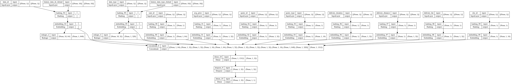

# DeepCTR-tf2
> tf2学习过程中练习用的代码，集中在常见的ctr预估算法

## 基本的文件结构
- DeepCTR-tf2
  - src：主要代码的存放路径
    - custom_utils：自定义工具类，主要包括自定义layers、losses、metrics、callback等
    - datas：数据读取工具类，解析原始数据的各种工具类
    - models：模型实现
      - functional
      - sequential
      - subclassing
    - utils：一些其他的工具
  - examples：测试数据的存放路径
    - conf：配置文件
    - datas：训练、测试数据
  
## 测试用例
* 调用说明：
```python
import tensorflow as tf

from src.utils.config import Config
from src.models.subclassing import mlp

config_ = Config('../examples/conf/')

mlp_model = mlp.MLPBuilder(config=config_)
tf.keras.utils.plot_model(mlp_model.build_graph(), show_shapes=True)
```
* 输出结果：
